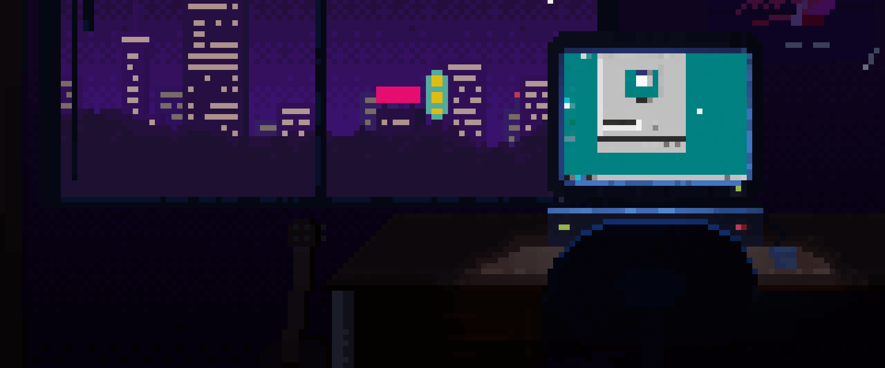

<h1 align="center">Hello there! 👋🻠I am Sanket Jagdale! </h1>
<h1 align="center">I am a Web Developer</h1>

&nbsp;&nbsp;
&nbsp;&nbsp;
&nbsp;&nbsp;

 

 

 
 

👨‍🎓I am Sanket Jagdale, currently embarking on my engineering journey from Vishwakarma Institute of Technology, Pune. 
💻I am a 🧑‍💻FullStack Web Developer as well as 🧑‍💻 Programmer💻 
I love⤠to make Exciting Projects ✨ 
I really enjoy learning new languages and technologies. 
I also love Cool Electronics Stuff. 

🌟 I’m currently working on Full-Stack Website. 
🌱 I’m currently learning DSA. 

 
 
 
<h1>Technical Skills 🛠</h1>

 

 <h3>Languages </h3> 

 

 <h3>Web Development Stack</h3> 

 

 

 

  

  

 

 <h3>Databases</h3> 

 

  

 

 
 
 <h3>Development Tools</h3> 

 

 
 
 
 
 
 
 
 

 
 
<h3>Version Control</h3>

 

 
  
 

 
 

 
 

 
<!--  -->
<!--  -->

<!-- ### Recent Projects 👨‍💻

<!--    -->

 

</img>

<!-- </img> -->

</img>

