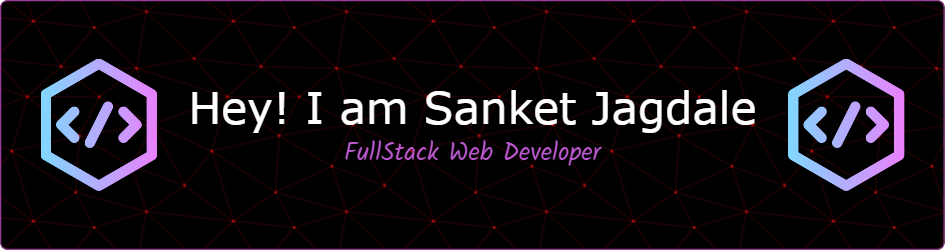

<!--  -->

 

  
  

&nbsp;&nbsp;
&nbsp;&nbsp;
&nbsp;&nbsp;

&nbsp;&nbsp;

 

</img>
 </img> 

 

 

<!-- 
  
 -->

👨‍🎓I am Sanket Jagdale, currently embarking on my engineering journey from Vishwakarma Institute of Technology, Pune. 
💻I am a 🧑‍💻FullStack Web Developer🧑‍💻 Problem Solver💻 Content Creator🌟 Technical Writer✍🏼  
I love⤠to make Exciting Projects✨ 
I really enjoy learning new languages and technologies. 
🌟 I’m currently working on Full-Stack Website. 
🌱 I’m currently learning BlockChain and DSA. 

 
 
 
 

 
 

  
  
<h1>Technical Skills 🛠</h1>

 

 <h3>Languages </h3> 

 

 <h3>Web Development Stack</h3> 

 

 
 
 

 
 
 <h3>Development Tools</h3> 

 

 
  

 

 
 
<h3>Version Control</h3>

 

  

 

<!--  

    

 -->
 
<!--  -->
<!--  -->

<!-- 
## Recent Projects 👨‍💻

 

 

  -->

<!--

 

 

 

 
-->

</img>

